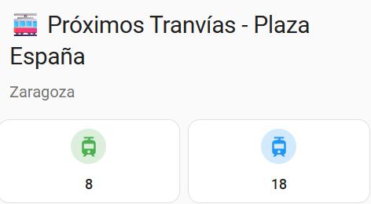
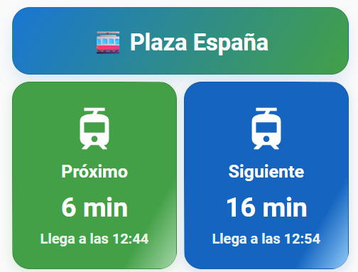

# **Zaragoza Tram**

[](https://github.com/custom-components/hacs)  


¡Bienvenido a la integración **Zaragoza Tram** para Home Assistant!  
Esta integración te permite crear sensores que muestran el tiempo restante para la llegada de los dos próximos tranvías a una parada específica de Zaragoza.  
Los datos se obtienen gracias a la API proporcionada por el Ayuntamiento de Zaragoza:  
[API REST Zaragoza](https://www.zaragoza.es/sede/portal/datos-abiertos/servicio/catalogo/327)

## **Instalación**

### **1. Manual**

1. Descarga los archivos de este repositorio.  
2. Copia la carpeta `zaragoza_tram` dentro del directorio `custom_components` de tu configuración de Home Assistant.
   - Si la carpeta `custom_components` no existe, créala en la raíz de tu configuración.  
3. Reinicia Home Assistant.

### **2. Usando HACS**

[](https://my.home-assistant.io/redirect/hacs_repository/?owner=jrgim&repository=Zaragoza_tram&category=integration)

1. Añade este repositorio como repositorio personalizado en HACS.  
2. Busca "Zaragoza Tram" en HACS e instálalo.  
3. Reinicia Home Assistant.

## **Configuración**

### **Desde la Interfaz de Usuario**

1. Ve a **Ajustes** → **Dispositivos e Integraciones**.  
2. Haz clic en el botón "+" y busca "Zaragoza Tram".  
3. Elige **Tranvía** o **Bus**.

**Tranvía**: selecciona la parada de la lista desplegable y ¡listo! Tendrás dos sensores (próximo y siguiente tranvía).

**Bus**: primero eliges cómo identificar la parada:
- **Buscar la parada en el listado**: escribe parte de la dirección (o el número de línea) y elige entre los resultados.
- **Ya sé el código de la parada**: escribe el código tal cual aparece en la marquesina/app oficial (`PA00239`) o el número de poste (`239`).

Después, opcionalmente puedes filtrar por línea. Si dejas la línea en blanco, eliges entre:
- **Próximo y siguiente (cualquier línea)**: dos sensores con las dos llegadas más próximas a la parada, sea cual sea la línea (la línea de cada llegada va en el atributo `linea`, ya que puede cambiar de una actualización a otra).
- **Una entidad por línea**: un par de sensores (próximo/siguiente) por cada línea que pase por esa parada.

---

## **Ejemplos de tarjetas Lovelace (opcionales)**

Puedes mostrar la información de los sensores en tu panel de Home Assistant usando tarjetas personalizadas.  
**Estos ejemplos son opcionales** y requieren instalar los siguientes complementos desde HACS si quieres usarlos:

- Para el ejemplo sencillo: [Mushroom Cards](https://github.com/piitaya/lovelace-mushroom)  
- Para el ejemplo avanzado: [button-card](https://github.com/custom-cards/button-card)

### **Ejemplo sencillo con Mushroom Cards**



```yaml
type: vertical-stack
cards:
  - type: custom:mushroom-title-card
    title: 🚋 Próximos Tranvías - Plaza España
    subtitle: Zaragoza
  - type: horizontal-stack
    cards:
      - type: custom:mushroom-entity-card
        entity: sensor.tranvia_1_plaza_espana_dir_mago_de_oz
        name: Próximo tranvía
        icon: mdi:tram
        icon_color: green
        primary_info: state
        secondary_info: none
        layout: vertical
        tap_action:
          action: more-info
      - type: custom:mushroom-entity-card
        entity: sensor.tranvia_2_plaza_espana_dir_mago_de_oz
        name: Siguiente tranvía
        icon: mdi:tram
        icon_color: blue
        primary_info: state
        secondary_info: none
        layout: vertical
        tap_action:
          action: more-info
```
### **Ejemplo avanzado para Plaza España (Dirección: Mago de Oz)**



```yaml
type: vertical-stack
cards:
  - type: custom:button-card
    name: 🚋 Plaza España
    label: "Dir: Mago de Oz"
    color_type: card
    styles:
      card:
        - background: "linear-gradient(120deg, #1976d2 0%, #43a047 100%)"
        - color: white
        - font-size: 22px
        - font-weight: bold
        - padding: 20px
        - border-radius: 20px
        - box-shadow: 0 8px 18px rgba(25,118,210,0.13)
      name:
        - font-size: 26px
        - font-weight: bold
      label:
        - font-size: 17px
        - color: "#e3f2fd"
        - padding-top: 6px
  - type: horizontal-stack
    cards:
      - type: custom:button-card
        entity: sensor.tranvia_1_plaza_espana_dir_mago_de_oz
        name: Próximo
        icon: mdi:tram
        color_type: icon
        show_state: true
        show_name: true
        show_label: true
        state_display: |
          [[[
            return entity.state + " min";
          ]]]
        label: |
          [[[
            let mins = parseInt(entity.state);
            if (!isNaN(mins)) {
              let date = new Date();
              date.setMinutes(date.getMinutes() + mins);
              let h = date.getHours().toString().padStart(2,'0');
              let m = date.getMinutes().toString().padStart(2,'0');
              return "Llega a las " + h + ":" + m;
            } else {
              return "Sin datos";
            }
          ]]]
        styles:
          card:
            - background: "linear-gradient(120deg, #43a047 80%, #a5d6a7 100%)"
            - color: white
            - font-size: 18px
            - font-weight: bold
            - border-radius: 20px
            - box-shadow: 0 4px 14px rgba(67,160,71,0.18)
            - padding: 24px
            - transition: box-shadow 0.3s
          icon:
            - color: white
            - width: 56px
            - height: 56px
            - animation: >
                [[[ return (entity.state < 5) ? "bounce 1s infinite" : "none"; ]]]
          name:
            - font-size: 20px
            - padding-top: 8px
          state:
            - font-size: 30px
            - font-weight: bold
            - padding-top: 10px
          label:
            - font-size: 16px
            - color: "#e8f5e9"
            - padding-top: 8px
        extra_styles: |
          @keyframes bounce {
            0%, 100% { transform: translateY(0);}
            50% { transform: translateY(-10px);}
          }
        tap_action:
          action: more-info
        hold_action:
          action: none
        double_tap_action:
          action: none
        triggers_update: all
      - type: custom:button-card
        entity: sensor.tranvia_2_plaza_espana_dir_mago_de_oz
        name: Siguiente
        icon: mdi:tram
        color_type: icon
        show_state: true
        show_name: true
        show_label: true
        state_display: |
          [[[
            return entity.state + " min";
          ]]]
        label: |
          [[[
            let mins = parseInt(entity.state);
            if (!isNaN(mins)) {
              let date = new Date();
              date.setMinutes(date.getMinutes() + mins);
              let h = date.getHours().toString().padStart(2,'0');
              let m = date.getMinutes().toString().padStart(2,'0');
              return "Llega a las " + h + ":" + m;
            } else {
              return "Sin datos";
            }
          ]]]
        styles:
          card:
            - background: "linear-gradient(120deg, #1565c0 80%, #90caf9 100%)"
            - color: white
            - font-size: 18px
            - font-weight: bold
            - border-radius: 20px
            - box-shadow: 0 4px 14px rgba(21,101,192,0.18)
            - padding: 24px
            - transition: box-shadow 0.3s
          icon:
            - color: white
            - width: 56px
            - height: 56px
          name:
            - font-size: 20px
            - padding-top: 8px
          state:
            - font-size: 30px
            - font-weight: bold
            - padding-top: 10px
          label:
            - font-size: 16px
            - color: "#e3f2fd"
            - padding-top: 8px
        tap_action:
          action: more-info
        hold_action:
          action: none
        double_tap_action:
          action: none
        triggers_update: all
```

### **Ejemplo con Mushroom Cards para bus (modo combinado)**

> ⚠️ **En modo "Próximo y siguiente (cualquier línea)" la línea de cada llegada NO aparece en el estado del sensor**, solo como atributo `linea` (porque puede cambiar de una actualización a otra — mira más arriba por qué). El diálogo estándar "más información" de Home Assistant no muestra ese atributo para un sensor normal, así que para verlo en el panel de un vistazo necesitas una tarjeta como esta (o consultarlo en **Herramientas de desarrollo → Estados**). Si prefieres tenerlo siempre visible sin depender de una tarjeta, usa el modo "Una entidad por línea" en su lugar.

En modo "Próximo y siguiente (cualquier línea)" la línea de cada llegada puede cambiar entre actualizaciones, así que en vez de una `mushroom-entity-card` normal usamos una `mushroom-template-card` para mostrar juntos el estado y el atributo `linea`. Cambia los `entity` por los tuyos (los ves en **Ajustes → Dispositivos y servicios → Entidades**).

```yaml
type: vertical-stack
cards:
  - type: custom:mushroom-title-card
    title: 🚌 Próximo Bus - Av. San Juan Bosco
    subtitle: Parada 239
  - type: horizontal-stack
    cards:
      - type: custom:mushroom-template-card
        entity: sensor.bus_proximo_parada_239
        primary: "Línea {{ state_attr(entity, 'linea') }}"
        secondary: "{{ states(entity) }} min"
        icon: mdi:bus
        icon_color: green
        layout: vertical
        tap_action:
          action: more-info
      - type: custom:mushroom-template-card
        entity: sensor.bus_siguiente_parada_239
        primary: "Línea {{ state_attr(entity, 'linea') }}"
        secondary: "{{ states(entity) }} min"
        icon: mdi:bus
        icon_color: blue
        layout: vertical
        tap_action:
          action: more-info
```

### **Ejemplo con button-card para bus (modo "una entidad por línea")**

En modo "Una entidad por línea" cada línea tiene su propio par de sensores, así que aquí la línea sí es fija y se puede poner directamente en el nombre de cada tarjeta (sin plantillas). Ejemplo con las líneas 22, 35 y 41 de la parada 239 — ajusta los `entity` y las líneas a las tuyas.

```yaml
type: vertical-stack
cards:
  - type: custom:button-card
    name: 🚌 Av. San Juan Bosco
    label: "Parada 239"
    color_type: card
    styles:
      card:
        - background: "linear-gradient(120deg, #ef6c00 0%, #f9a825 100%)"
        - color: white
        - font-size: 22px
        - font-weight: bold
        - padding: 20px
        - border-radius: 20px
        - box-shadow: 0 8px 18px rgba(239,108,0,0.13)
      name:
        - font-size: 26px
        - font-weight: bold
      label:
        - font-size: 17px
        - color: "#fff3e0"
        - padding-top: 6px
  - type: horizontal-stack
    cards:
      - type: custom:button-card
        entity: sensor.bus_22_proximo_parada_239
        name: Línea 22
        icon: mdi:bus
        color_type: icon
        show_state: true
        show_name: true
        state_display: |
          [[[
            return entity.state + " min";
          ]]]
        styles:
          card:
            - background: "linear-gradient(120deg, #43a047 80%, #a5d6a7 100%)"
            - color: white
            - font-weight: bold
            - border-radius: 20px
            - padding: 16px
          state:
            - font-size: 24px
            - font-weight: bold
        tap_action:
          action: more-info
      - type: custom:button-card
        entity: sensor.bus_35_proximo_parada_239
        name: Línea 35
        icon: mdi:bus
        color_type: icon
        show_state: true
        show_name: true
        state_display: |
          [[[
            return entity.state + " min";
          ]]]
        styles:
          card:
            - background: "linear-gradient(120deg, #1565c0 80%, #90caf9 100%)"
            - color: white
            - font-weight: bold
            - border-radius: 20px
            - padding: 16px
          state:
            - font-size: 24px
            - font-weight: bold
        tap_action:
          action: more-info
      - type: custom:button-card
        entity: sensor.bus_41_proximo_parada_239
        name: Línea 41
        icon: mdi:bus
        color_type: icon
        show_state: true
        show_name: true
        state_display: |
          [[[
            return entity.state + " min";
          ]]]
        styles:
          card:
            - background: "linear-gradient(120deg, #6a1b9a 80%, #ce93d8 100%)"
            - color: white
            - font-weight: bold
            - border-radius: 20px
            - padding: 16px
          state:
            - font-size: 24px
            - font-weight: bold
        tap_action:
          action: more-info
```
